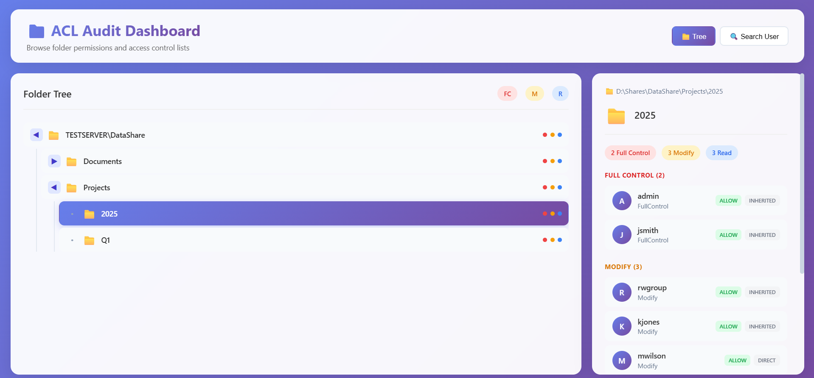

# 📁 ACL Audit Dashboard

> *See who has access to what, instantly.* 🚀

A powerful, web-based tool for visualizing and auditing Windows file system Access Control Lists (ACLs). Stop sifting through thousands of folders with `icacls.exe` – get a beautiful, interactive tree view that shows permissions at a glance.



---

## ✨ Features

- **🌳 Interactive Tree View** – Browse folder hierarchies with expand/collapse navigation
- **🔍 User Search** – Find all folders a specific user has access to
- **🎨 Visual Indicators** – Color-coded permission levels (Full Control, Modify, Read)
- **⚡ Fast Performance** – Efficient caching handles tens of thousands of folders
- **📊 Permission Details** – Click any folder to see detailed ACL information
- **🏢 Multi-Server Support** – Audit multiple file servers in a single dashboard

---

## 🚀 Quick Start

### 1. Scan Your File Share

```powershell
# Basic scan
.\Gather-ACLsDirect.ps1 -Path "D:\Shares" -ServerName "FileServer01"

# Custom output file
.\Gather-ACLsDirect.ps1 -Path "D:\Shares" -ServerName "FileServer01" -OutputPath "my_acl.json"

# Verbose mode (watch the progress)
.\Gather-ACLsDirect.ps1 -Path "D:\Shares" -ServerName "FileServer01" -VerboseMode
```

### 2. Start the Dashboard

```powershell
# Default (port 5000, uses acl_data_light.json)
.\acl_server.ps1

# Custom port
.\acl_server.ps1 -Port 8080

# Custom data file
.\acl_server.ps1 -DataFile "my_acl.json"
```

### 3. Open in Browser

Navigate to **http://127.0.0.1:5000**

---

## 📋 Usage Guide

### Dashboard Views

#### 📁 Tree View (Default)
- Browse your folder structure by expanding/collapse nodes
- Each folder shows permission indicators:
  - 🔴 **Red dot** – Full Control
  - 🟡 **Yellow dot** – Modify
  - 🔵 **Blue dot** – Read
- Click any folder to view detailed permissions

#### 🔍 User Search View
- Switch to "Search User" tab
- Type a username or partial match (e.g., `jsmith`, `admin`)
- See all folders that user has permissions on
- Results grouped by folder with permission types

### Permission Levels

| Type | Color | Description |
|------|-------|-------------|
| **Full Control** | 🔴 Red | Complete control – read, write, modify, delete, change permissions |
| **Modify** | 🟡 Yellow | Read, write, append, delete – but can't change permissions |
| **Read** | 🔵 Blue | View and read files/folders only |

---

## 🔧 How It Works

```
┌─────────────────────────────────────────────────────────────┐
│                     Work                                    │
├─────────────────────────────────────────────────────────────┤
│                                                             │
│  ┌─────────────┐         ┌──────────────┐                   │
│  │   Windows   │         │   PowerShell │                   │
│  │  File Share │ ──────► │  ACL Scanner │                   │
│  └─────────────┘         └──────┬───────┘                   │
│                                │                            │
│                                ▼                            │
│                          acl_data_light.json                │
│                                │                            │
│                                ▼                            │
│  ┌─────────────┐         ┌──────────────┐                   │
│  │   Browser   │ ──────► │   HTTP API   │                   │
│  │  Dashboard  │ ◀─────  │   (Server)   │                   │
│  └─────────────┘         └──────────────┘                   │
│                                                             │
└─────────────────────────────────────────────────────────────┘
```

1. **Gather** – `Gather-ACLsDirect.ps1` scans your file share and exports permissions to JSON
2. **Serve** – `acl_server.ps1` runs a lightweight web server and loads the JSON data
3. **View** – `acl_dashboard.html` provides the interactive UI that queries the server API

---

## 📦 Project Structure

```
ACLs/
├── Gather-ACLsDirect.ps1    # PowerShell script to scan and export ACLs
├── acl_server.ps1           # HTTP server that serves dashboard + API
├── acl_dashboard.html       # Single-page web application
├── acl_data_light.json      # Generated ACL data (default output)
├── test.json                # Sample/test data for demos
└── README.md                # This file
```

---

## 🎯 Use Cases

- **Security Audits** – Review who has access to sensitive folders
- **Permission Cleanup** – Identify over-privileged accounts
- **Compliance Reporting** – Document access controls for audits
- **Onboarding/Offboarding** – Ensure removed users no longer have access
- **Folder Migration** – Plan permissions before moving data

---

## 🛠 Requirements

- **Windows** (PowerShell 5.1 or later)
- **File Share** to audit (local or network path)
- **Browser** (Chrome, Edge, Firefox, Safari – any modern browser)

---

## 💡 Tips & Tricks

### Large File Shares
For shares with thousands of folders:
- Scan with `-VerboseMode` to monitor progress
- The server uses lazy indexing – user search index builds on first search
- Cache pre-processing makes subsequent runs faster

### Testing & Demos
Use the provided `test.json` to demo the dashboard without scanning:
```powershell
.\acl_server.ps1 -DataFile "test.json"
```

### Filter System Accounts
By default, the scanner filters out:
- `NT AUTHORITY\SYSTEM`
- `NT AUTHORITY\AUTHENTICATED USERS`
- `BUILTIN\Administrators`
- `BUILTIN\Users`
- `BUILTIN\CREATOR OWNER`
- `EVERYONE`

To include them, edit `Gather-ACLsDirect.ps1` and comment out the filtering section.

---

## 🤝 Commands Reference

### Gather-ACLsDirect.ps1

| Parameter | Type | Required | Description |
|-----------|------|----------|-------------|
| `-Path` | string | ✅ Yes | Root directory path to scan |
| `-ServerName` | string | ✅ Yes | Identifier for this server |
| `-OutputPath` | string | Optional | Output JSON file (default: `acl_data_light.json`) |
| `-VerboseMode` | switch | Optional | Show detailed progress |
| `-Help` | switch | Optional | Display help message |

### acl_server.ps1

| Parameter | Type | Required | Description |
|-----------|------|----------|-------------|
| `-Port` | int | Optional | HTTP port (default: 5000) |
| `-DataFile` | string | Optional | JSON data file (default: `acl_data_light.json`) |
| `-Help` | switch | Optional | Display help message |

---

## 🐛 Troubleshooting

**"Path not found" error**
- Ensure the path exists and is accessible
- Use absolute paths when in doubt: `C:\Shares\MyShare`

**Dashboard won't load**
- Check that `acl_dashboard.html` is in the same directory as `acl_server.ps1`
- Verify the data file was generated successfully
- Try a different port if 5000 is in use

**Slow performance**
- First scan of a large share will take time
- Subsequent reads from the JSON file are fast
- User search builds an index on first use

---

## 📄 License

MIT. Scan your own file systems responsibly.

---

## 🙏 Credits

Built with ❤️ using:
- **PowerShell** – Windows automation
- **Vanilla JavaScript** – No frameworks, pure performance
- **CSS Grid & Flexbox** – Modern responsive layout

---

*Happy auditing! 🎉*
